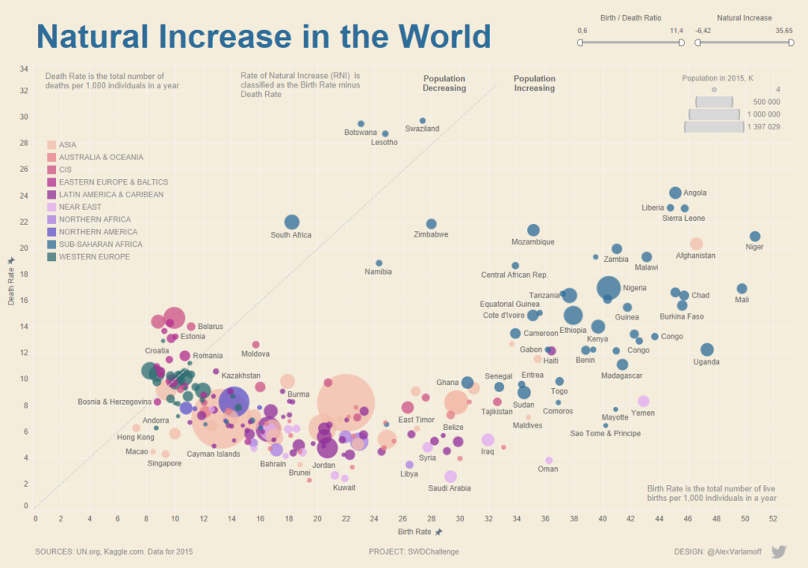
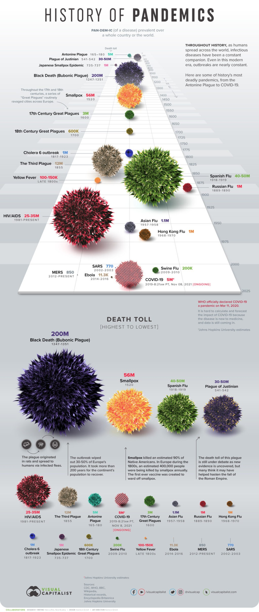
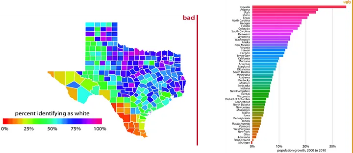

# Evaluasi Visualisasi Data Berdasarkan 4 Prinsip

## 1. Natural Increase in the World

- **Kategori: Good**
- **Alasan**:
  - **Strive for form and function**: Bentuk scatter plot yang menyajikan hubungan antara birth rate dan death rate jelas. Titik-titik berwarna menunjukkan wilayah geografis tertentu, membantu dalam identifikasi.
  - **Always justify the selection of everything we do**: Pemilihan ukuran lingkaran menggambarkan populasi, dan warna menunjukkan wilayah. Ini membantu pengguna memahami data lebih dalam, misalnya hubungan antara wilayah dan tingkat pertumbuhan alami.
  - **Create accessibility through intuitive design**: Skala dan label yang jelas membuat visualisasi ini mudah diakses oleh pengguna dengan latar belakang beragam.
  - **Never deceive the receiver**: Data tidak menyesatkan, karena perbandingan death rate dan birth rate disajikan dengan skala yang akurat.

---

## 2. History of Pandemics

- **Kategori: Good**
- **Alasan**:
  - **Strive for form and function**: Menyajikan informasi sejarah dengan visualisasi bola yang mewakili dampak pandemi berdasarkan ukuran. Ukurannya sesuai dengan death toll dari setiap pandemi.
  - **Always justify the selection of everything we do**: Warna dan ukuran bola mewakili data dengan tepat, membantu pengguna membedakan seberapa signifikan setiap pandemi.
  - **Create accessibility through intuitive design**: Desain intuitif dan urutan waktu jelas membuat informasi mudah dipahami bahkan bagi non-ahli.
  - **Never deceive the receiver**: Informasi tidak menyesatkan, dan grafik memberikan perspektif yang jujur terkait dampak pandemi dalam sejarah.

---

## 3. Percent Identifying as White (Texas) & Population Growth Comparison

- **Kategori: Bad**
- **Alasan**:
  - **Strive for form and function**: Peta pertama berwarna-warni namun tidak jelas apa makna di balik pemilihan warna yang berlebihan. Tidak ada skala yang jelas selain presentase, yang tidak menjelaskan arti dari perbedaan intensitas warna. Grafik kedua juga menggunakan skema warna yang terlalu mencolok.
  - **Always justify the selection of everything we do**: Pemilihan warna yang tidak konsisten dapat mengganggu fokus dan menyebabkan kebingungan dalam memahami data.
  - **Create accessibility through intuitive design**: Desainnya tidak intuitif, dan pengguna mungkin kesulitan memahami informasi tanpa petunjuk lebih lanjut. Penggunaan warna yang tidak tepat membuatnya sulit diakses oleh pengguna dengan penglihatan warna terbatas.
  - **Never deceive the receiver**: Grafik peta Texas tidak menyesuaikan dengan skala atau interval yang cukup representatif sehingga dapat menyesatkan tentang demografi wilayah.
